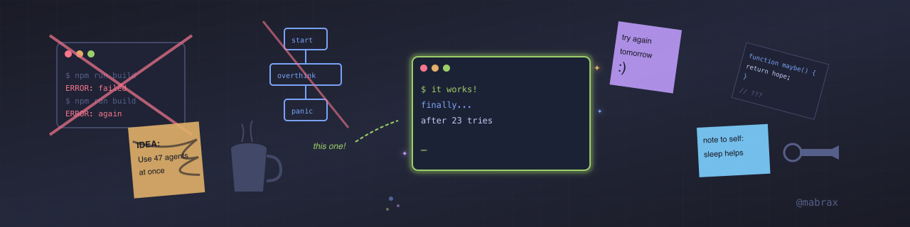

# Hey! 👋

I'm Felipe.

I'm betting my time on an idea: that AI tooling can give one engineer leverage that wasn't possible before. I don't know if I'm right. But I'm building, documenting, and sharing what I find.

This isn't "figured it out" territory. This is figuring it out, in public.

## What I'm Playing With

- **Agent workflows** — pipelines that let me move faster (when they work)
- **Claude skills** — custom tools I use daily, refined through dogfooding
- **Open source tooling** — giving away what I build, keeping what I learn

## The Approach

I follow Polya's problem-solving framework: understand, plan, execute, look back. That last step matters most. Every experiment—success or failure—produces learning that compounds.

Movement is life. Movement is learning. Movement is evolving.

## What You'll Find Here

- Tools I'm building (some polished, some rough)
- Experiments in progress
- Things that didn't work (those are useful too)

I show the work raw. The wrong turns included.

## Find Me

- Website: [mabrax.ai](https://mabrax.ai)
- Newsletter: *coming soon*

If you're also figuring this out, say hi. Always curious what others are building. ✌️
